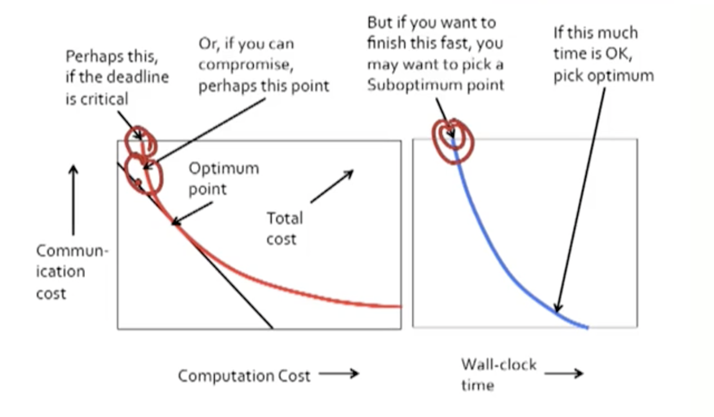
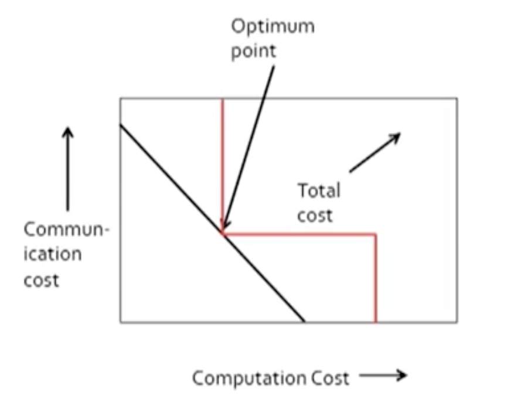

#### Notations:

* Map-Reduce = Map function + Reduce function
* Map Task = Map-function execution on a chunk of inputs.
* Reduce Task = Reduce-function execution on one or more key-(list of values) pairs.
* *Mapper* = application of the Map function to a single input.
* *Reducer* = application of the Reduce function to a single key-(list of values) pair.

#### Cost of Map-Reduce Jobs

1. *Computation cost* of mappers, reducers, and system.
   * System cost is principally sorting key-value pairs by key and merging them at Reduce tasks, plus some arrangements. 
2. *Communication cost* shipping key-value pairs from mappers to reducers.
   * Assume Map tasks are executed where their input data resides, so no communication required.
   * Assume every key-value pair has to be moved. 

##### Observations simplifying the calculation of the cost of Map-Reduce Jobs

1. Computation at the mappers is usually a small fraction of the communication cost and can be neglected. 
   * Under the common case that mappers do something simple and its running time is proportional to its output.
2. System cost of sorting is typically proportional to the communication cost. 
   * It does sorts by key, then the system cost maybe proportional to $n\log n$, where $n$ is the number of key-value pairs.
   * An external merge sort is in practice linear, so we assume that either the sorting time is small compared with communication cost if it's small enough that a main memory sort is possible OR it's so large that the sort must be done on disk then it's proportional to the communication cost. 
3. Communication cost often dominates computation cost.  
   * On typical computing clusters, communication cost accounts for the majority of the wall-clock time needed to finish the job no matter how many computation nodes we used. 

##### Additional Notes

1. On a public cloud, we pay for computation AND communication.
   * Balancing the two is an important part of algorithm design.
2. To finishing fast (low wall-clock time) requires a high degree of parallelism - force to cost higher. 
3. Second trade-off: parallelism vs minimum cost. How fast you want and affordable.  

##### Reducer Size - The Hidden Variable

For some problems, the computation is the same no matter how you partition the problem. However, in many cases, the big issue is whether a reducer has too much input to operate in main memory, i.e., it has to swap data between main memory and secondary memory. Then the time to do the same computation can go up radically. Unfortunately we would need a lot of communication is get reducers with samll input size. 

##### Consequence: communication & computation trade-off is a step function

There is one computation cost if the communication is sufficiently high, and another larger cost if the communication is too low. 

The optimum point representing the computation cost assuming everything can be done in the main memory. And the minimum communication necessary to allow reducers to take that small amount of data. 

